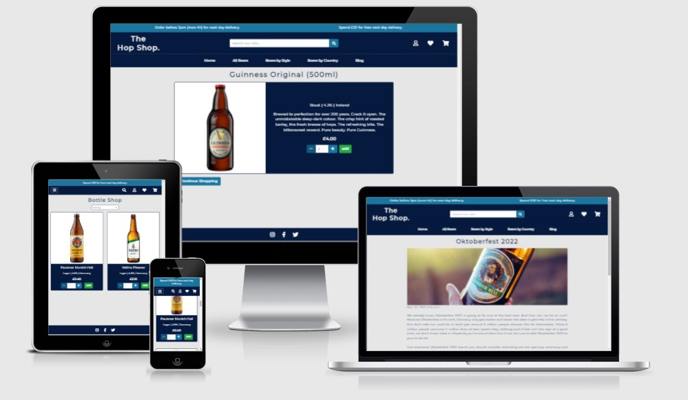
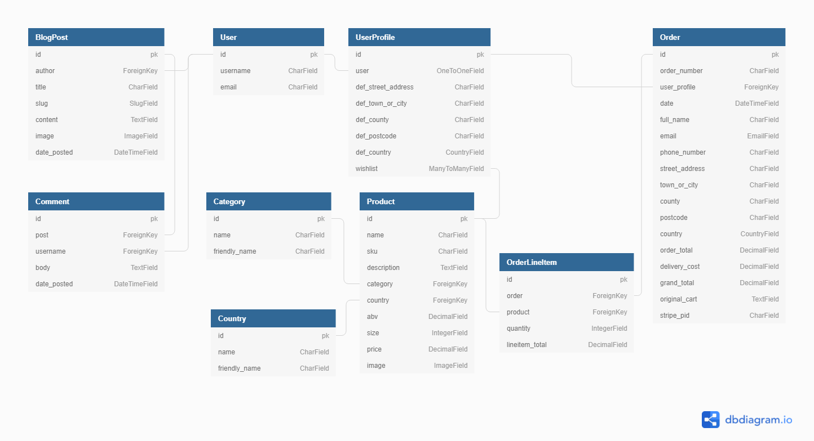

# The Hop Shop

### Milestone Project Four
Over the past couple of years the UK has had a craft beer boom with its popularity never being higher. The market for craft beers is now a saturated, highly competitive one with new breweries and retailers specialising in it appearing all the time. As demand grows, tastes change and the fact that consumers now expect a greater variety of choice has made bottle shops very popular.

The Hop Shop is an e-commerce store that is tapping into this demand. They'll offer numerous types of beers from all over Europe to be purchased conveniently, all from one place satisfying the everyday beer aficionado. 

## Demo
The live site can be viewed here - [The Hop Shop](https://hop-shop.herokuapp.com/).

GitHub repository can be viewed here - [mitchdavenport88/hop_shop](https://github.com/mitchdavenport88/hop_shop).



## UX
### Strategy
The aim is to create a user-friendly e-commerce store based around controlling a centrally owned dataset, which I will be building. As an e-commerce store the site will be based around the business logic of being able to browse and select items to buy then finally completing the transaction and taking a payment.

Users should be able to view products in the store both individually and collectively. They should be shown in an appropriate and clear way, with any user having the ability to filter or search for items by using pre-determined filters or keywords. Items will be able to be added and removed from a shopping cart and then finally paid for. Any user should be able to complete a transaction easily on The Hop Shop but users will be encouraged to register in order to have access to their own profile where order history is stored and default delivery information can be saved. The ability to use a wishlist function will also only be given to registered users as well as the ability to comment on The Hop Shops blog posts. In addition to this the store owner (admin) should be able to add, edit and remove both products and blog posts conveniently from the frontend.

### User Stories
As a shopper I'd like to:
* View a selection of products and select those I wish to purchase.
* Look at individual product details in order to consolidate my decision on whether to purchase the item or not.
* Filter products based on their type or where they originate from.
* Sort products by price, strength or size.
* To search for products by using keywords.
* Add items to the cart to purchase at a later point.
* Easily view the carts contents and the number of items within it.
* Be given the ability to amend the quantity of items within the cart or remove items completely.
* Be rewarded with free delivery if I’m buying a decent amount of products.
* Checkout, pay and complete my order easily.
* Have order confirmation once my order has been completed.
* Navigate around the site easily and the site to be user friendly.
* Receive feedback whilst interacting with the site.
* Do all of the above regardless of what device I’m using.

As a returning user I'd like:
* To sign up and register for an account easily. 
* To login and logout easily.
* To receive email confirmation of registration and have the ability to recover forgotten passwords.
* A personalised user profile where I can see my order history and set my default delivery information if desired.
* Access to a wishlist where favourites can be added / removed so I can easily purchase them at a later date.
* To read beer related articles as I’m a regular consumer of beer and I’d find a blog interesting.
* The ability to comment and interact with other users on the blog posts.

As the site owner / admin I want:
* The ability to add new products to the store.
* To be able to edit and remove products from the store.
* The ability to create and post new articles to the blog.
* To be able to edit and remove existing posts from the blog.

### Scope
* The site must have a section where all products are displayed, for all users to see.
    * All products shown will have to be done so in a visually appealing manner.
    * Users will want the ability to search, filter and add products to their cart.
    * Each card should act as a link to its own page.
* Individual product pages will follow a template, which will be populated from the database.
    * All information on this page should be clear and presented in a visually appealing manner.
* Items must be able to be added to a cart. The items in the cart can be removable or the quantities selected amendable.
* A user must be able to complete the checkout process easily from cart through to order completion.
    * Methods of data input must be clear and inputted data must get validated.
    * The site will need to relay information back to the user when required or suitable in an appropriate manner.
    * A payment and the order must be taken.
* Allow users to login, logout and register.
    * Restrictions will need to be placed on what unregistered users can see and use.
* Access to a personalised profile page that shows order history (registered user only).
* In order to try and create a community and engage with users more a blog about beers, trends and events would be a good addition.
    * Registered users could communicate with one another via comments.
* A wishlist function would also engage with registered users as they can select products that they’d like to purchase at a later date, this could encourage repeat business.
* CRUD functionality for products and blog articles (admin only).
* We want the user to remain engaged throughout use so must be user-friendly and easy to navigate around.
* Function as expected:
    * Fully responsive on all devices.
    * Links or buttons take you to the expected place or complete the expected task.
    * External links must open in new windows.

### Structure
Based on the information gathered so far the structure of The Hop Shop will be:
* Fixed navigation bar at the top of every page. This will house the shop’s logo, search bar and links to other pages on the site. Some links will apply filters to the results shown.
* A home page with a hero image and a call-to-action button directing the user to the store.
* Django allauth will handle the log in/ log out and registration processes.
* Products page where product cards are displayed.
    * Ability to filter results with pre-determined options.
    * Each card will link to the product detail page, where further information is shown.
    * Users will be able to add items to their carts.
    * Registered users can add items to their wishlist.
* Individual product pages will show an image along with further information about the product.
    * Users will be able to add the item to their carts.
    * Registered users can add the item to their wishlist here also.
    * Admin will be able edit and delete the product from this page.
* The cart page will show all the items the user has added to their cart, the details of the products in the cart, the quantity and the subtotal of each item. This page will be the start of the checkout process so a link to checkout will be available here also.
* Checkout page where the users personal information, delivery address along with their payment details are taken to be processed.
* Checkout success page confirms the order and payment has been taken and authorised.
* The user profile page will be created for all registered users and tailored to them. It will show their order history along with the ability to edit / add their default delivery information via a form.
* Blog page where all articles are displayed via cards. Each card will link to the relevant articles page, where it can be read in full and also commented on.
* Individual blog article pages show the articles in full and will feature a comments section underneath. 
    * The ability to comment will be available to registered users only.
    * Admin will be able edit and delete the article from this page.
* Wishlist page that displays the individual cards of products that’ve been added to the list.
    * Only available to registered users.
* Add product / blog post form will be accessible by admin only. This form will input the supplied data into the database and the product / post will then be viewable on the site.
* Edit product / blog post form will be accessible by admin only. The form will be pre-populated with the existing data and any changes made will then overwrite / remove existing data. 
* Footer with social media links will be at the bottom of every page.

### Skeleton
Home - [desktop](readme-docs/wireframes/home(desktop).png) | 
[tablet](readme-docs/wireframes/home(tablet).png) | 
[mobile](readme-docs/wireframes/home(phone).png).

Products - [desktop](readme-docs/wireframes/products(desktop).png) | 
[tablet](readme-docs/wireframes/products(tablet).png) | 
[mobile](readme-docs/wireframes/products(phone).png).

Product detail - [desktop](readme-docs/wireframes/product-detail(desktop).png) | 
[tablet](readme-docs/wireframes/product-detail(tablet).png) | 
[mobile](readme-docs/wireframes/product-detail(phone).png).

Add / edit product - [desktop](readme-docs/wireframes/edit-add-product(desktop).png) | 
[tablet](readme-docs/wireframes/edit-add-product(tablet).png) | 
[mobile](readme-docs/wireframes/edit-add-product(phone).png).

Cart - [desktop](readme-docs/wireframes/cart(desktop).png) | 
[tablet](readme-docs/wireframes/cart(tablet).png) | 
[mobile](readme-docs/wireframes/cart(phone).png).

Checkout - [desktop](readme-docs/wireframes/checkout(desktop).png) | 
[tablet](readme-docs/wireframes/checkout(tablet).png) | 
[mobile](readme-docs/wireframes/checkout(phone).png).

Checkout success - [desktop](readme-docs/wireframes/checkout-success(desktop).png) | 
[tablet](readme-docs/wireframes/checkout-success(tablet).png) | 
[mobile](readme-docs/wireframes/checkout-success(phone).png).

Profile - [desktop](readme-docs/wireframes/profile(desktop).png) | 
[tablet](readme-docs/wireframes/profile(tablet).png) | 
[mobile](readme-docs/wireframes/profile(phone).png).

Blog - [desktop](readme-docs/wireframes/blog(desktop).png) | 
[tablet](readme-docs/wireframes/blog(tablet).png) | 
[mobile](readme-docs/wireframes/blog(phone).png).

Blog post / article - [desktop](readme-docs/wireframes/blog-post(desktop).png) | 
[tablet](readme-docs/wireframes/blog-post(tablet).png) | 
[mobile](readme-docs/wireframes/blog-post(phone).png).

Wishlist - [desktop](readme-docs/wireframes/wishlist(desktop).png) | 
[tablet](readme-docs/wireframes/wishlist(tablet).png) | 
[mobile](readme-docs/wireframes/wishlist(phone).png).

Allauth templates - [desktop](readme-docs/wireframes/all-auth-template(desktop).png) | 
[tablet](readme-docs/wireframes/all-auth-template(tablet).png) | 
[mobile](readme-docs/wireframes/all-auth-template(phone).png).

### Surface
The Hop Shop is built using Bootstraps grid system. I’ve used a combination of containers, rows and columns along with the built in flexbox capabilities to position content as well as making each page responsive at all breakpoints. Another positive to using this grid system is that it’s allowed me to keep the layout of pages consistent throughout.

Pages have a similar layout of page title followed by its content. Some pages contain a lot of information (such as the product pages) so in order not to overpower the user with a lot of information at once, products are displayed via cards. These cards show just the basic information and link to the individual product page. Where the use of cards wasn’t applicable (such as the individual product pages and pages that feature forms) I broke information up by using block colour and columns. Doing so ties in with the overall aesthetic of the site, adds some space between information and forms where appropriate whilst remaining visually appealing and responsive.

I found a suitable colour palette using [Coolors](https://coolors.co/). The scheme is a combination of Oxford Blue (#061A40) and Celadon Blue (#1A759F) that work well together, work well with white text and gives the site the professional, modern aesthetic I was after. I decided that buttons for adding, updating and checking out were to use Bootstraps success class as this green colour is more associated with actions of this type. For delete functions I used Bootstraps danger class for the same reasoning. The Google font Montserrat is used throughout. I used it for just the logo initially and it worked really well so I decided to use it everywhere else. I feel it works well with the colour scheme, fits in with the aesthetic created and more importantly it is easy to read.


## Database



## Technologies
### Languages:
* HTML.
* CSS.
* JavaScript.
* Python.

### Databases:
* SQLite – Development database provided by Django.
* PostgreSQL – Production database provided via Heroku.

### Frameworks, libraries and tools:
* Django. Python web framework with external libraries.
    * External libraries are visible in the requirements.txt file.
* [jQuery.](https://jquery.com/) JavaScript library.
* Gitpod (IDE).
* Git and GitHub. Used for version control and hosting my repository.
* [Heroku.](https://heroku.com/) Used to host my site.
* [AWS S3 Bucket.](https://aws.amazon.com/) Cloud storage for media and static files used by Heroku.
* [Stripe.](https://stripe.com/gb) Online payment processing for internet businesses used to receive payments.
* [Gmail.]() I've hooked my deployed site up to Gmail's smtp server in order to send emails. 
* [Font Awesome.](https://fontawesome.com/) Adds icons throughout the site to increase UX.
* [Bootstrap.](https://getbootstrap.com/) Grid layout, responsive design and basic styling.
* [Google fonts.](https://fonts.google.com/specimen/Rubik) Montserrat was imported and used throughout.
* [Favicon.io.](https://favicon.io/) Created favicon's, which are visible in browser tabs and the bookmarks bar.
* [Balsamiq.](https://balsamiq.com/) Programme used for drawing the wireframes.
* [RandomKeygen.](https://randomkeygen.com/) Secure password and keygen generator used for secret key.
* [Am I responsive?](http://ami.responsivedesign.is/) Gives a visual representation of how the website looks on different devices. Also used to produce the mock-up shown above.
* [Dbdiagram.io.](https://dbdiagram.io/home) Used to draw entity-relationship diagram above showing relationships within my database.
* [TinyPNG.](https://tinypng.com/) Reduces file size of the image files used.
* [AutoPrefixer.](https://autoprefixer.github.io/) Adds vendor prefixes to CSS code for use on additional browsers.
* W3C [HTML](https://validator.w3.org/) & [CSS](https://jigsaw.w3.org/css-validator/) validators.
* [JSHint.](https://jshint.com/) JavaScript validator.
* [PEP8 online.](http://pep8online.com/) Checks python code meets PEP8 requirements.

## Testing
Separate testing document can be found here - [testing documentation.](TESTING.md)

## Deployment
### Heroku deployment
This project is hosted by Heroku but is still deployed from the master branch of a GitHub repository. The following steps were taken to deploy this project to Heroku:
1. Went to [Heroku](https://heroku.com/) and logged in.
2. Created a new app by clicking **create new app** from the drop down menu labelled "new".
3. Gave my app a name and selected the region from the dropdown menu that was closest geographically. 
4. Clicked the **create app** button where I was directed to the dashboard for the new app.
5. Clicked on the **resources** tab on the dashboard. Added Heroku Postgres to the app by searching and then selecting it. Then I selected the Hobby Dev – Free plan.
6. As I didn't use fixtures to populate my development database I now created three json files, which act as fixtures and will help transfer the data across to the Postgres database.
    * `python3 manage.py dumpdata products.Category > categories.json`
    * `python3 manage.py dumpdata products.Country > countries.json`
    * `python3 manage.py dumpdata products.Product > products.json`
7. Installed dj_database_url and psycopg2-binary using `pip3 install`.
8. In `settings.py` I imported dj_database_url at the top of the file.
9. Then replaced the default `DATABASE` setting with:
```
DATABASES = {
        'default': dj_database_url.parse(<DATABASE_URL>)
    }
```
The `<DATABASE_URL>` is found in the Heroku apps **Config Vars**. It's important that you don't commit this url into version control!

10. I ran migrations using `python3 manage.py migrate` to create the models in the new database.
11. I now used the json files created in step 6 to populate the new database. I loaded them in this order as the Product model depends on both the Country and Category models.
    * `python3 manage.py loaddata categories.json`
    * `python3 manage.py loaddata countries.json`
    * `python3 manage.py loaddata products.json`
12. Then I created a new superuser, this was done by using `python3 manage.py createsuperuser` and then following the instructions shown in the terminal.
13. Installed gunicorn using `pip3 install`.
14. Used `pip3 freeze > requirements.txt`, this stores all our apps requirements.
15. Created a Procfile and populated it with:
```
web: gunicorn <app_name>.wsgi:application
```
16. I logged into Heroku but this time via the terminal using `heroku login -i`.
17. Then I used `heroku config:set COLLECTSTATIC=1 --app <app_name>` to disable static files from being collected. This is only a temporary measure.
18. Added the hostname of the Heroku app to `ALLOWED_HOSTS` in `settings.py`
```
ALLOWED_HOSTS = ['<hostname>', 'localhost']
```
19. Returned to the Heroku dashboard, clicked on the **deploy** tab, scrolled down to the “Deployment method” section and clicked the **connect to GitHub** button. 
20. I searched for my repository in the “Connect to GitHub” section, found it and clicked **connect**.
21. I then enabled **Automatic Deploys**.
22. At the top of the dashboard I selected the **settings** tab. Scrolled down to the **Config Vars** section and populated the section with the key value pairs of the following:
    * AWS_ACCESS_KEY_ID - I get this when I set up AWS.
    * AWS_SECRET_ACCESS_KEY - I get this when I set up AWS.
    * DATABASE_URL - Prepopulated.
    * DISABLE_COLLECTSTATIC - Created this during step 17.
    * SECRET_KEY
    * STRIPE_PUBLIC_KEY
    * STRIPE_SECRET_KEY
    * STRIPE_WH_SECRET
    * USE_AWS - True
23. I changed the default `DATABASE` setting we created in step 9 in `settings.py` so that it now retrieves the value from Heroku:
```
DATABASES = {
        'default': dj_database_url.parse(os.environ.get('DATABASE_URL'))
    }
```
24. Added, committed and pushed all files via the terminal.
25. Heroku is now set up and the app visible. It will automatically update whenever commits are pushed to Github via the IDE.

<details>
<summary>Setting up S3</summary>

1. Create an [AWS](https://aws.amazon.com/) account.
2. Navigate to the management console, search for "S3" to be taken to the S3 dashboard.
3. Click **create bucket** button.
    * Give it a name and select the region closest to you.
    * Allow public access.
4. In the bucket's properties select **static website hosting**.
    * Select "use this bucket to host a website".
    * Give it the default values of `index.html` and `error.html` then save.
5. For the buckets permissions CORS configuration use:
```
[
  {
      "AllowedHeaders": [
          "Authorization"
      ],
      "AllowedMethods": [
          "GET"
      ],
      "AllowedOrigins": [
          "*"
      ],
      "ExposeHeaders": []
  }
]
```
6. For the buckets permissions policy:
    * Copy the Amazon resource name (ARN) from the top of the page.
    * Click "policy generator".
    * Select type of policy as "S3 Bucket Policy".
    * Allow all principals by using `*`.
    * Set action to "GetObject".
    * Paste in the ARN.
    * Click **Add statement**. Then **Generate policy** and copy the json file shown.
    * Paste this json file to bucket policy.
        * Add `/*` at the end of the 'Resource' key.
    * Save.
7. For the access control list:
    * Set list objects to everyone.
</details>

<details>
<summary>Setting up IAM (Identity and Access Management)</summary>

1. From the AWS management console, search for "IAM" to be taken to the IAM dashboard.
2. Creating a group:
    * Select "Groups" from the menu.
    * Click the **Create new group** button.
    * Name the group.
3. Creating a policy:
    * Select "Policies" from the menu.
    * Click the **Create policy** button.
    * Select the **JSON** tab and click the "import managed policy" link.
        * Find and import **Amazon S3 Full Access**.
    * In the 'Resource' key of the json code shown paste in the ARN from the bucket policy twice forming a list.
        * Add `/*` to the end of one.
    * Review the policy and give it a name and a description.
    * **Create policy**.
4. Attaching the policy to the group:
    * Select "Groups" from the menu and select the group created in step 2.
    * Click the **Attach policy** button.
    * Select the policy created in step 3.
    * **Attach policy**.
5. Creating a user:
    * Select "Users" from the menu.
    * Click the **Add user** button.
    * Create a user by giving them a name.
    * Grant the programatic access and click **Next**.
    * Select the group shown that has the policy attached.
    * **Create user**.
6. Download the .csv file.
</details>

<details>
<summary>Connect Django to S3</summary>

1. Install boto3 by using `pip3 install boto3`.
2. Install django-storages by using `pip3 install django-storages`.
3. Run `pip3 freeze > requirements.txt`.
4. Add 'storages' to the apps list in `settings.py`.
5. Add the values of AWS_ACCESS_KEY_ID and AWS_SECRET_ACCESS_KEY to **Config Vars** in Heroku.
    * These values are in the downloaded .csv file.
6. Delete the DISABLE_COLLECTSTATIC variable.
7. Create a file called `custom_storages.py` and populate it like so:
```
from django.conf import settings
from storages.backends.s3boto3 import S3Boto3Storage


class StaticStorage(S3Boto3Storage):
    location = settings.STATICFILES_LOCATION


class MediaStorage(S3Boto3Storage):
    location = settings.MEDIAFILES_LOCATION
```
8. Add the following to `settings.py`.
```
if 'USE_AWS' in os.environ:
    AWS_STORAGE_BUCKET_NAME = '<aws_bucket_name>'
    AWS_S3_REGION_NAME = '<aws_region>'
    AWS_ACCESS_KEY_ID = os.environ.get('AWS_ACCESS_KEY_ID')
    AWS_SECRET_ACCESS_KEY = os.environ.get('AWS_SECRET_ACCESS_KEY')
    AWS_S3_CUSTOM_DOMAIN = f'{AWS_STORAGE_BUCKET_NAME}.s3.amazonaws.com'

    STATICFILES_STORAGE = 'custom_storages.StaticStorage'
    STATICFILES_LOCATION = 'static'
    DEFAULT_FILE_STORAGE = 'custom_storages.MediaStorage'
    MEDIAFILES_LOCATION = 'media'

    STATIC_URL = f'https://{AWS_S3_CUSTOM_DOMAIN}/{STATICFILES_LOCATION}/'
    MEDIA_URL = f'https://{AWS_S3_CUSTOM_DOMAIN}/{MEDIAFILES_LOCATION}/'
```
9. Add, commit and push all via the terminal.
</details>

<details>
<summary>Adding and committing files</summary>

I’ve been using Gitpod to write my code and using the terminal to add, commit and push code from my workspace to GitHub where it is stored remotely as shown in the course content.
1. Typing `git add` into the terminal will move files to the staging area. You should normally do this once a couple of minor additions or changes have been made or one large change or addition has been made. `git add .` will add all files that have been modified, the full stop here means all. If I want to be more selective I can type in the file name e.g. index.html or the files pathway e.g. assets/css/style.css instead of the full stop e.g. `git add index.html`.
2. To send these changes to the local repository we use `git commit`. Normally you'll want to include a brief description of these changes so instead use `git commit –m “ ”`. Between the “ ” write a clear, concise message detailing what this commit has done.
3. To view the changes on Heroku or when you want to send your work to the remote repository (GitHub in this instance) then use the `git push` command. This pushes all the previous commits made to the remote repository. While deploying to Heroku we set it so it'll automatically pick up any changes pushed to our GitHub repository and once Heroku has finished building (this takes a couple of mins) it'll display the most up to date version of the site.
</details>

### Cloning
You can clone a repository so that it can be worked on locally in an IDE such as VSCode by following these steps:
1. Log in to GitHub and navigate to the repository you wish to clone.
2. Click the button that reads **code**. This button is situated to the left of the green Gitpod button near the top of the page.
3. To clone the repository using HTTPS, copy the link shown whilst HTTPS is selected. The link will look something like this: `https://github.com/YOUR-USERNAME/YOUR-REPOSITORY`
4. Open your local IDE and in the terminal navigate to the working directory of where you wish to insert the cloned directory.
5. Type `git clone` followed by the link you copied in step 3 into the terminal, this will look something like this: `git clone https://github.com/YOUR-USERNAME/YOUR-REPOSITORY`
6. Press **enter** and the clone will be created in your selected / current working directory (cwd).
7. A new `env.py` file will have to be created to include all the environment variables used throughout and should look like below.
    * Both STRIPE_PUBLIC_KEY and STRIPE_SECRET_KEY can be found on the **Developers** dashboard once logged into Stripe.
    * The STRIPE_WH_SECRET can be found once a new endpoint has been created in **Developers** > **Webooks**.
        1. Click on the 'Add endpoint' button.
        2. Enter the URL of your localhost followed by `/checkout/wh/` as your endpoint URL.
        3. Select all events to listen to and click on the 'Add endpoint' button.
        4. The value for STRIPE_WH_SECRET can now be found by clicking the 'reveal' link under the signing secret tab on the webhook's dashboard.
    * Add `env.py` to the .gitignore file so it doesn’t get published in version control.
```
import os

os.environ.setdefault(“SECRET_KEY”,  “<secret key>”)
os.environ.setdefault(“DEVELOPMENT”, “True”)
os.environ.setdefault(“STRIPE_PUBLIC_KEY”, “<key from stripe developers dashboard>”)
os.environ.setdefault(“STRIPE_SECRET_KEY”, “<key from stripe developers dashboard>”)
os.environ.setdefault(“STRIPE_WH_SECRET”, “<key from individual webhook>”)
```
8. You will need to reinstall all the dependencies used, you can do this by running the following `pip3 install -r requirements.txt` in the terminal.
9. You will then need to migrate the database by typing `python3 manage.py migrate` in the terminal.
10.	A new superuser will now need to be created, this can be done by typing `python3 manage.py createsuperuser` in the terminal and following the instructions shown.
11. The site is now cloned… Use the command `python3 manage.py runserver` to run it.

## Credits
### Code
* I used the Boutique Ado e-commerce store project that is part of the course content as a guide as I built my site. Many of the apps, models and functionality’s have been taken from this walkthrough and adapted to suit my needs.
* I watched the following video's about creating e-commerce stores on youTube to enhance my knowledge after completing the Boutique Ado walkthrough:
    * [Corey Schafer.](https://www.youtube.com/playlist?list=PL-osiE80TeTtoQCKZ03TU5fNfx2UY6U4p)
    * [Dennis Ivy.](https://www.youtube.com/watch?app=desktop&v=_ELCMngbM0E)
* This [Stack Overflow post](https://stackoverflow.com/questions/43824382/custom-font-src-with-stripe/56985340) helped me integrate google fonts into Stripe in the stripe_elements.js file.
* This [Stack Overflow post](https://stackoverflow.com/questions/51304169/how-to-put-the-number-at-top-right-corner-of-cart-icon) helped me with the code for the count badge found on the cart.
* I followed these two articles by [Django Central](https://djangocentral.com/) and this video by [Codemy.com](https://www.youtube.com/watch?v=hZrlh4qU4eQ) when setting up my blog and comments section. I made changes where I saw fit to suit my requirements and also added to the code:
    * [Blog.](https://djangocentral.com/building-a-blog-application-with-django/)
    * [Blog comments.](https://djangocentral.com/creating-comments-system-with-django/)
* I found out about the linebreaksbr functionality used in the blog posts [here.](https://docs.djangoproject.com/en/dev/ref/templates/builtins/#linebreaksbr)
* I resolved an issue causing a 500 internal server error being made by the function in my products model that resizes images if required by reading this [Stack Overflow post.](https://stackoverflow.com/questions/18215989/resize-thumbnails-django-heroku-backend-doesnt-support-absolute-paths)
* I made the wishlist view by following a walkthrough by [Very Academy.](https://www.youtube.com/watch?v=OgA0TTKAtqQ&t=2403s) I made changes where I saw fit to suit my requirements and also added to the code.
* I used the following documentation throughout:
    * [Django docs.](https://docs.djangoproject.com/en/3.2/)
    * [Allauth docs.](https://django-allauth.readthedocs.io/en/latest/index.html)
    * [Stripe - accepting a payment docs.](https://stripe.com/docs/payments/accept-a-payment?platform=web&ui=elements#web-collect-payment-details)
    * [jQuery docs.](https://api.jquery.com/)
    * [Crispy forms docs.](https://django-crispy-forms.readthedocs.io/en/latest/index.html)
* [W3schools,](https://www.w3schools.com/) [Stack Overflow](https://stackoverflow.com/) & [MDN.](https://developer.mozilla.org/en-US/) For general coding problem solving.

### Content
* [Beerwulf](https://www.beerwulf.com/en-gb) was a big inspiration to this site.
* Home / landing page hero image - [JuniperPhoton via Unsplash.](https://unsplash.com/photos/9i2YH9vyfWQ)
* Oktoberfest 2022 image - [Marius Oppel via Unsplash.](https://unsplash.com/photos/E53rbNwqEMI)
* Duvel blog post image - [Ferment blog article.](https://www.beer52.com/ferment/article/1053/duvel-moortgat)
* No product image - [freesvg.org.](https://freesvg.org/vector-graphics-of-bottle-of-beer)
* The product descriptions were taken from the brewers websites.
* The blog posts were taken from the following and edited accordingly to suit:
    * [Oktoberfest 2020.](https://www.oktoberfesttours.travel/oktoberfest-2022/)
    * [Duvel wins gold!](https://www.duvel.com/en-gb/news/duvel-wins-gold-at-brussels-beer-challenge-2018)

### Acknowledgements
* My mentor Brian Macharia for all the feedback and aiding in the planning and execution of this site.
* Tutor support at Code Institute for their help and support when needed most.
* README examples:
    * [Taikatta.](https://github.com/taikatta/Mileston4-EggSellNT)
    * [Samathaluca.](https://github.com/samathaluca/new-lazycamp)

### Disclaimer
This site has been created purely for educational purposes.