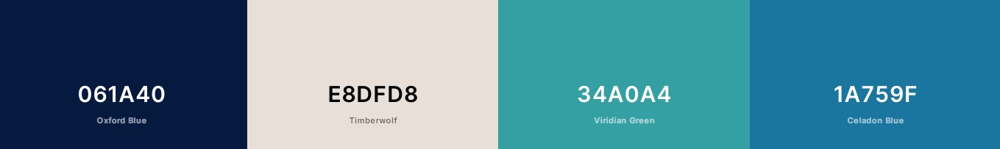

# The Hop Shop

### Milestone Project Four
Over the past couple of years the UK has had a craft beer boom with its popularity never being higher. The market for craft beers is now a saturated, highly competitive one with new breweries and retailers specialising in it appearing all the time. As demand grows, tastes change and the fact that consumers now expect a greater variety of choice has made bottle shops very popular.

The Hop Shop is an e-commerce store that is tapping into this demand. They'll offer numerous types of beers from all over Europe to be purchased conveniently, all from one place satisfying the everyday beer aficionado. 

## Demo
The live site can be viewed here - [The Hop Shop](https://hop-shop.herokuapp.com/).

GitHub repository can be viewed here - [mitchdavenport88/hop_shop](https://github.com/mitchdavenport88/hop_shop).

## UX
### Strategy
The aim is to create a user-friendly e-commerce store based around controlling a centrally owned dataset, which I will be building. As an e-commerce store the site will be based around the business logic of being able to browse and select items to buy then finally completing the transaction and taking a payment.

Users should be able to view products in the store both individually and collectively. They should be shown in an appropriate and clear way, with any user having the ability to filter or search for items by using pre-determined filters or keywords. Items will be able to be added and removed from a shopping cart and then finally paid for. Any user should be able to complete a transaction easily on The Hop Shop but users will be encouraged to register in order to have access to their own profile where order history is stored and default delivery information can be saved. The ability to use a wishlist function will also only be given to registered users as well as the ability to comment on The Hop Shops blog posts. In addition to this the store owner (admin) should be able to add, edit and remove both products and blog posts conveniently from the frontend.

### User Stories
As a shopper I'd like to:
* View a selection of products and select those I wish to purchase.
* Look at individual product details in order to consolidate my decision on whether to purchase the item or not.
* Filter products based on their type or where they originate from.
* Sort products by price, strength or size.
* To search for products by using keywords.
* Add items to the cart to purchase a later point.
* Easily view the carts contents and the number of items within it.
* Be given the ability to amend the quantity of items within the cart or remove items completely.
* Be rewarded with free delivery if I’m buying a decent amount of products.
* Checkout, pay and complete my order easily.
* Have order confirmation once my order has been completed.
* Navigate around the site easily and the site to be user friendly.
* Receive feedback whilst interacting with the site.
* Do all of the above regardless of what device I’m using.

As a returning user I'd like:
* To sign up and register for an account easily. 
* To login and logout easily.
* To receive email confirmation of registration and have the ability to recover forgotten passwords.
* A personalised user profile where I can see my order history and set my default delivery information if desired.
* Access to a wishlist where favourites can be added / removed so I can easily purchase them at a later date.
* To read beer related articles as I’m a regular consumer of beer and I’d find a blog interesting.
* The ability to comment and interact with other users on the blog posts.

As the site owner / admin I want:
* The ability to add new products to the store.
* To be able to edit and remove products from the store.
* The ability to create and post new articles to the blog.
* To be able to edit and remove existing posts from the blog.

### Scope
* The site must have a section where all products are displayed, for all users to see.
    * All products shown will have to be done so in a visually appealing manner.
    * Users will want the ability to search, filter and add products to their cart.
    * Each card should act as a link to its own page.
* Individual product pages will follow a template, which will be populated from the database.
    * All information on this page should be clear and presented in a visually appealing manner.
* Items must be able to be added to a cart. The items in the cart can be removable or the quantities selected amendable.
* A user must be able to complete the checkout process easily from cart through to order completion.
    * Methods of data input must be clear and inputted data must get validated.
    * The site will need to relay information back to the user when required or suitable in an appropriate manner.
    * A payment and the order must be taken.
* Allow users to login, logout and register.
    * Restrictions will need to be placed on what unregistered users can see and use.
* Access to a personalised profile page that shows order history (registered user only).
* In order to try and create a community and engage with users more a blog about beers, trends and events would be a good addition.
    * Registered users could communicate with one another via comments.
* A wishlist function would also engage with registered users as they can select products that they’d like to purchase at a later date, this could encourage repeat business.
* CRUD functionality for products and blog articles (admin only).
* We want the user to remain engaged throughout use so must be user-friendly and easy to navigate around.
* Function as expected:
    * Fully responsive on all devices.
    * Links or buttons take you to the expected place or complete the expected task.
    * External links must open in new windows.

### Structure
Based on the information gathered so far the structure of The Hop Shop will be:
* Fixed navigation bar at the top of every page. This will house the shop’s logo, search bar and links to other pages on the site. Some links will apply filters to the results shown.
* A home page with a hero image and a call-to-action button directing the user to the store.
* Django allauth will handle the log in/ log out and registration processes.
* Products page where product cards are displayed.
    * Ability to filter results with pre-determined options.
    * Each card will link to the product detail page, where further information is shown.
    * Users will be able to add items to their carts.
    * Registered users can add items to their wishlist.
* Individual product pages will show an image along with further information about the product.
    * Users will be able to add the item to their carts.
    * Registered users can add the item to their wishlist here also.
    * Admin will be able edit and delete the product from this page.
* The cart page will show all the items the user has added to their cart, the details of the products in the cart, the quantity and the subtotal of each item. This page will be the start of the checkout process so a link to checkout will be available here also.
* Checkout page where the users personal information, delivery address along with their payment details are taken to be processed.
* Checkout success page confirms the order and payment has been taken and authorised.
* The user profile page will be created for all registered users and tailored to them. It will show their order history along with the ability to edit / add their default delivery information via a form.
* Blog page where all articles are displayed via cards. Each card will link to the relevant articles page, where it can be read in full and also commented on.
* Individual blog article pages show the articles in full and will feature a comments section underneath. 
    * The ability to comment will be available to registered users only.
    * Admin will be able edit and delete the article from this page.
* Wishlist page that displays the individual cards of products that’ve been added to the list.
    * Only available to registered users.
* Add product / blog post form will be accessible by admin only. This form will input the supplied data into the database and the product / post will then be viewable on the site.
* Edit product / blog post form will be accessible by admin only. The form will be pre-populated with the existing data and any changes made will then overwrite / remove existing data. 
* Footer with social media links will be at the bottom of every page.

### Skeleton
Home - [desktop](readme-docs/wireframes/home(desktop).png) | 
[tablet](readme-docs/wireframes/home(tablet).png) | 
[mobile](readme-docs/wireframes/home(phone).png).

Products - [desktop](readme-docs/wireframes/products(desktop).png) | 
[tablet](readme-docs/wireframes/products(tablet).png) | 
[mobile](readme-docs/wireframes/products(phone).png).

Product detail - [desktop](readme-docs/wireframes/product-detail(desktop).png) | 
[tablet](readme-docs/wireframes/product-detail(tablet).png) | 
[mobile](readme-docs/wireframes/product-detail(phone).png).

Add / edit product - [desktop](readme-docs/wireframes/edit-add-product(desktop).png) | 
[tablet](readme-docs/wireframes/edit-add-product(tablet).png) | 
[mobile](readme-docs/wireframes/edit-add-product(phone).png).

Cart - [desktop](readme-docs/wireframes/cart(desktop).png) | 
[tablet](readme-docs/wireframes/cart(tablet).png) | 
[mobile](readme-docs/wireframes/cart(phone).png).

Checkout - [desktop](readme-docs/wireframes/checkout(desktop).png) | 
[tablet](readme-docs/wireframes/checkout(tablet).png) | 
[mobile](readme-docs/wireframes/checkout(phone).png).

Checkout success - [desktop](readme-docs/wireframes/checkout-success(desktop).png) | 
[tablet](readme-docs/wireframes/checkout-success(tablet).png) | 
[mobile](readme-docs/wireframes/checkout-success(phone).png).

Profile - [desktop](readme-docs/wireframes/profile(desktop).png) | 
[tablet](readme-docs/wireframes/profile(tablet).png) | 
[mobile](readme-docs/wireframes/profile(phone).png).

Blog - [desktop](readme-docs/wireframes/blog(desktop).png) | 
[tablet](readme-docs/wireframes/blog(tablet).png) | 
[mobile](readme-docs/wireframes/blog(phone).png).

Blog post / article - [desktop](readme-docs/wireframes/blog-post(desktop).png) | 
[tablet](readme-docs/wireframes/blog-post(tablet).png) | 
[mobile](readme-docs/wireframes/blog-post(phone).png).

Wishlist - [desktop](readme-docs/wireframes/wishlist(desktop).png) | 
[tablet](readme-docs/wireframes/wishlist(tablet).png) | 
[mobile](readme-docs/wireframes/wishlist(phone).png).

Allauth templates - [desktop](readme-docs/wireframes/all-auth-template(desktop).png) | 
[tablet](readme-docs/wireframes/all-auth-template(tablet).png) | 
[mobile](readme-docs/wireframes/all-auth-template(phone).png).

### Surface
The Hop Shop is built using Bootstraps grid system. I’ve used a combination of containers, rows and columns along with the built in flexbox capabilities to position content as well as making each page responsive at all breakpoints. Another positive to using this grid system is that it’s allowed me to keep the layout of pages consistent throughout.

Pages have a similar layout of page title followed by its content. Some pages contain a lot of information (such as the product pages) so in order not to overpower the user with a lot of information at once products are displayed via cards. These cards show just the basic information and link to the individual product page. Where the use of cards wasn’t applicable (such as the individual product pages and pages that feature forms) I broke information up by using block colour and columns. Doing so ties in with the overall aesthetic of the site, adds some space between information and forms where appropriate whilst remaining visually appealing and responsive.

I found a suitable colour palette using [Coolors](https://coolors.co/). The scheme is a combination of Oxford Blue (#061A40) and Celadon Blue (#1A759F) that work well together, work well with white text and gives the site the professional, modern aesthetic I was after. I decided that buttons for adding, updating and checking out were to use Bootstraps success class as this green colour is more associated with actions of this type. For delete functions I used Bootstraps danger class for the same reasoning. The Google font Montserrat is used throughout. I used it for just the logo initially and it worked really well so I decided to use it everywhere else. I feel it works well with the colour scheme, fits in with the aesthetic created and more importantly it is easy to read.

## Database

## Technologies
### Languages:
* HTML.
* CSS.
* JavaScript.
* Python.

### Databases:
* SQLite – Development database provided by Django.
* PostgreSQL – Production database provided via Heroku.

### Frameworks, libraries and tools:
* Django. Python web framework with external libraries.
    * External libraries are visible in the requirements.txt file.
* [jQuery.](https://jquery.com/) JavaScript library.
* Gitpod (IDE).
* Git and GitHub. Used for version control and hosting my repository.
* [Heroku.](https://id.heroku.com/) Used to host my site.
* [AWS S3 Bucket.](https://aws.amazon.com/) Cloud storage for media and static files used by Heroku.
* [Stripe.](https://stripe.com/gb) Online payment processing for internet businesses used to receive payments. 
* [Font Awesome.](https://fontawesome.com/) Adds icons throughout the site to increase UX.
* [Bootstrap.](https://getbootstrap.com/) Grid layout, responsive design and basic styling.
* [Google fonts.](https://fonts.google.com/specimen/Rubik) Montserrat was imported and used throughout.
* [Favicon.io.](https://favicon.io/) Created favicon's, which are visible in browser tabs and the bookmarks bar.
* [Balsamiq.](https://balsamiq.com/) Programme used for drawing the wireframes.
* [RandomKeygen.](https://randomkeygen.com/) Secure password and keygen generator used for secret key.
* [Am I responsive?](http://ami.responsivedesign.is/) Gives a visual representation of how the website looks on different devices. Also used to produce the mock-up shown above.
* [Dbdiagram.io.](https://dbdiagram.io/home) Used to draw entity-relationship diagram above showing relationships within my database.
* [TinyPNG.](https://tinypng.com/) Reduces file size of the image files used.
* [AutoPrefixer.](https://autoprefixer.github.io/) Adds vendor prefixes to CSS code for use on additional browsers.
* W3C [HTML](https://validator.w3.org/) & [CSS](https://jigsaw.w3.org/css-validator/) validators.
* [JSHint.](https://jshint.com/) JavaScript validator.
* [PEP8 online.](http://pep8online.com/) Checks python code meets PEP8 requirements.

## Testing
Separate testing document can be found here - [testing documentation.](TESTING.md)
