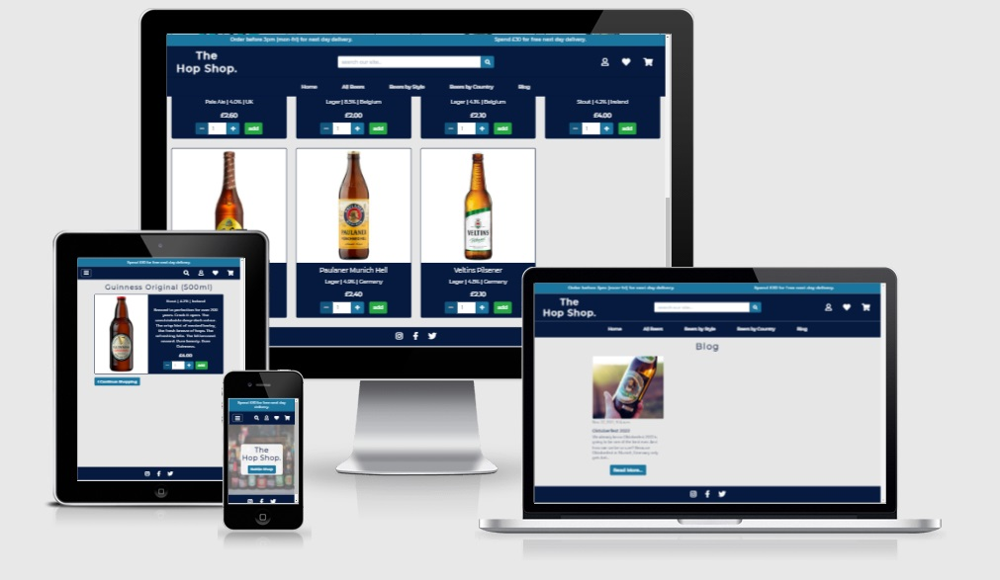
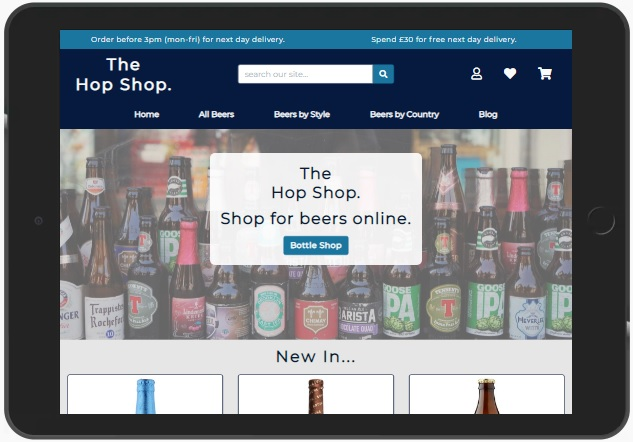

# Milestone Project Four - Testing

The live site can be viewed here - [The Hop Shop](https://hop-shop.herokuapp.com/).

[Back to README file.](README.md)

## Testing
All my code has been put through the following:

* W3C HTML validation.
* CSS AutoPrefixer.
* W3C CSS validation.
* JSHint JavaScript validation.
* PEP8 online check.

## Functionality
### Manual Testing
These are the steps I went through testing my website and it's functionality.

**Navigation:**
1.	Checked the navigation bar remains at the top of the page at all times and is never hidden by any other content.
2.	Checked the banner at the top of the navigation bar always displays delivery information.
3.	Clicked The Hop Shop logo at varying points to make sure it’s a link back to the home page.
4.	Tested the search bar:
    * Checked that it’s centrally aligned and that the placeholder is visible.
    * Hovered over the search button (icon) to check that the hover class works.
    * Clicked the button to test what it does:
        * Loads the products page and shows products that match the search.
        * I checked that by submitting an empty search I get an error message telling me so.
5.  Checked that the three icons linking to the profile page, wishlist and cart appear to the right of the navigation bar.
    * Checked that they perform as expected for:
        * Unregistered users.
        * Registered users.
        * Admin.
    * Checked that all the hover classes work.
    * Checked that if there are any items in the shopping cart then the number of items will show on the cart icon.
6.	I’ve clicked on all the links to ensure they do what they're supposed to do.
    * Home and blog take me to the relevant pages.
    * All Beers, beers by style and beers by country links have an additional dropdown menu that displays the filtering options. 
    * Tested that the hover classes all work.
7.	Checked that at widths below 992px the navigation bar adapts to something more suited to smaller screen sizes. 
    * Seen that all links are now displayed via a dropdown (hamburger) menu only.
        * Toggled the menu icon button on and off to check it displays and hides the menu accordingly.
        * Clicked all links to test they work as before and as expected.
    * Checked that the search bar is now hidden and can only be accessed by toggling the magnifying glass icon that now appears alongside the other three icons on the right hand side of the navigation bar.
    * Seen that the delivery information in the top banner adapts accordingly.

**Footer:**
1.	Checked the footer sticks to the bottom of every page and never hides any content.
2.	Checked that the social links are always aligned centrally and that the hover classes work.
3.	Clicked on all icons in the footer to check that they open and do so in a new tab.

**Home:**
1.	Checked that the background image isn't pixelated, is positioned well and loads as intended.
2.	Checked the text overlay box appears and that the relevant text and button is visible within it.
    * Tested the call-to-action button and it sends us to the Bottle Shop as desired.
    * Checked the hover class on the button works.
    * Checked the overlay box and its contents are always justified and aligned centrally.
    * Checked that at widths below 992px only the Hop Shop logo and call-to-action button are visible.
3.	Checked that the four most recently added products to the store are displayed under the hero image as part of the ‘new in…’ section.
    * All products are shown as individual cards and are suitably displayed dependant of the breakpoint.
    * Tested the cards against the ***individual product card test** that’s shown below as part of the products test.

**Products:**
1.	Checked that all pages are titled Bottle Shop.
2.	Checked that all products load as expected.
3.	Checked that if a filter has been applied from the navigation that it’s taken effect.
    * Products should display in the order specified (if applicable).
    * Correct products are displayed according to which filter has been applied (if applicable).
4.	Seen that the sort by… dropdown menu loads and is positioned where intended, underneath the page title and to the right of the page.
    * Checked that this gets centralised on screen widths below 992px.
    * Checked that each selection applies the intended filter and that the cards below are displayed in order of what’s selected.
5. Checked that the cards are displayed as intended at varying breakpoints:
    * In four columns on screen widths above 1200px.
    * In three columns on screen widths between 992px and 1200px.
    * In two columns on screen widths between 768px and 992px.
    * In one column on screen widths below 768px.

**Individual product card test (test also conducted on other sections)**

Check that every card contains:
* A product image that adjusts dependant to screen width.
    * Checked that this image also links to the products details page.
    * Shows the products name.
    * Details the products type | percentage | origin.
        * Tested that the products type and origin names act as links to the products page and apply a filter to the results shown based upon the category clicked. 
    * Show the products price.
    * The add to cart button and quantity selector appear at the bottom of the card.
        * Sen that a quantity is shown in the box (default number should be 1).
        * Tested that the + and – buttons increase or decrease the number.
            * Checked that + gets disabled at 99.
            * Checked that - gets disabled at 1.
            * Tested that numbers outside this range can’t be added manually.
        * Pressed the add button to check that the correct quantity of the item gets added to the cart.
            * Seen that a toast message appears confirming this addition.
            * The toast shows a preview of the cart.
            * Checked the cart icon in the navigation bar updates accordingly.
            * Checked the correct number of items have been added to the cart.
        * Hovered over the buttons to check the hover classes work.
    * Checked that for registered users a heart icon appears in the top right of each card, on top of the image. This indicates that it can be added to / removed from the wishlist.
        * As a heart outline indicates the item is not on the list I tested that clicking it adds the item to the wishlist and then the icon appeared solid. 
        * As a solid heart indicates the item is already on the list I tested that clicking it removes the item from the wishlist and the icon is now an outline.
        * Test the hover class works.
        * Checked that the toast message appears confirming whether it’s been added or removed from the list.

**Product detail page:**
1. Checked that the correct product has been loaded.
2. Check that the products name and size is shown at the top of the page as the page’s title.
3. Checked that all relevant information has been loaded and is displayed as expected.
4. Check the card according to the ***individual product card test** shown in the products test above as the results and functions are similar.
    * Checked that the product description is displayed as well as all the other information specified in the test.
5. Checked that on screen widths of below 576px the card adapts with the products information now being displayed underneath the products image but still in a card format.
6. Seen that the appropriate buttons based on the user’s registration status appear below underneath the product information:
    * The Continue Shopping button appears for all users underneath the products card and this takes me back to the Bottle Shop.
    * Check that the edit and delete buttons appear for admin only.
        * Checked the edit product button opens the edit product form.
        * Checked the delete product button triggers the deletion modal.
    * Checked that all hover classes work.

**Cart:**
1.	Checked that at the top of the page a banner informing the user how much more they need to spend to qualify for free delivery shows (if applicable).
    * Checked that if items in the cart equate to over £30 then the user is informed they’ve qualified for free delivery.
2.	Checked the page title also displays the current count of items in the cart.
3.	A Continue Shopping button appears underneath the title taking me back to the Bottle Shop.
4.	Checked that if the cart is empty a message relaying this appears.
    * Seen that the page title reads just ‘My Cart’.
5.	Checked that if items do exist in the cart then each individual item line has its own row with the following details:
    * Image (this gets hidden below 768px).
        * Checked this links back to individual product page.
    * Product info should always be displayed.
        * Checked the title links back to individual product page.
    * Quantity adjustment buttons, quantity and the update and remove links.
        * Checked that the correct quantity is shown in the box.
        * Tested that the + and – buttons increase or decrease this number.
            * Checked that + gets disabled at 99.
            * Checked that - gets disabled at 1.
        * Pressed the update link:
            * Seen that the quantity in the cart has changed to that chosen.
            * Seen the toast message confirming this change.
            * Checked the rows subtotal has adjusted accordingly.
            * Checked the overall totals below adjust.
            * Checked the free next day delivery banner adjusts (if applicable).
        * Pressed the remove link:
            * Checked that the item is removed from the cart and is no longer displayed. 
            * Seen the toast message appears confirming the removal.
            * Checked the rest of the cart reacts accordingly.
    * Checked that the subtotal is always displayed.
6.	Tested that each row is responsive to screen width and the most important information is always displayed.
7.	Checked the totals are shown underneath the last row and are done so in a clear and obvious manner.
8.	Pressed the checkout button at the bottom, this takes me to the checkout page.

**Checkout:**
1.	Tested that each page is fully responsive and everything stacks on top of one another at widths below 768px.
2.	Checked that the order summary section is reflective of the cart page that I’ve just been on.
    * Checked that the order summary title has an item count next to it.
    * Checked each line item is listed and matches that of that what was in the cart.
    * Checked that the subtotal, delivery and total all match too.
3.	Adjust cart button takes the user back to the cart page if amendments need to be made.
4.	Checked the form to capture the users details, delivery information and payment details is broken into three sections
    * Details
        * Made up of three input fields: *full name, *email and *phone number. Fields marked with a * are required in order to submit the form.
        * Checked if the user is unregistered all fields will be blank showing the placeholders only. 
        * Checked if the user is registered and has ordered something previously from the site then these fields could be pre-populated if they have default delivery information saved to their profile.
    * Delivery
        * Made up of five input fields: *address, *town, county, postcode and *country. Fields marked with a * are required in order to submit the form.
        * Checked if the user is unregistered all fields will be blank showing the placeholder only. 
        * Checked if the user is registered and has ordered something previously from the site then these fields could be pre-populated if they have default delivery information saved to their profile.
    * Payment
        * One field that takes the card number, the MM/YY and CVC number.
        * Checked that this field is required and will always be blank.
5.	Checked the form validates properly by:
    * Attempting to send an empty form.
    * Attempting to send the form whilst leaving any of the * fields empty.
    * Checking that the email field only accepts something with an @ in it.
    * Attempted to send while leaving the payment field empty. This causes a validation error sent from Stripe.
6.	Checked that dependent on user status either a link to log in or sign up appears or a check box to save delivery information is shown after the delivery details.
    * Clicked the log in link.
    * Clicked the sign up link.
    * Toggled the checkbox to test it works and appears for registered users only.
7.	Checked that two buttons appear at the bottom of the screen along with a confirmation of the total:
    * Checked the hover classes works.
    * Checked the amounts match throughout.
    * Adjust cart button takes the user back to the cart page in case amendments need to be made.
    * Pressing the place order button starts the checkout / Stripe’s payment process.
8.	Checked the order processing overlay appears to show that something is happening.
9.	On successful completion of the order I’m sent to the order success page where a summary of the order is displayed.
10.	Checked the page is responsive and everything stacks on top on one another at widths below 768px.

**Order confirmation:**
1.	Checked confirmation page loads as it should. 
    * A note to say where the confirmation has been sent appears.
    * A success toast appears confirming the order.
    * All information on the confirmation is relevant and correct:
        * Order info (order number and order date) is shown.
        * Delivery info (address and contact number) is shown.
        * Order details shown.
        * Billing details (subtotal, delivery and total) are shown.
2.	Checked that I received the confirmation email sent.
3.	Checked that Stripe has taken the payment.
4.	Checked the order now appears in the database.
5.	Checked that if I’m a registered user the order appears in my profile under order history.
6.	Checked if my delivery information gets saved.
    * If box is ticked then existing information is overwritten.
    * If it’s left unticked then nothing gets saved.
7.	Checked that the page is responsive and everything stacks on top on one another at widths below 768px.

**Profile:**
1.	Checked the page is only accessible to registered users.
2.	Checked that the user’s username appears in the title.
3.	Seen that the page is split into two sections:
    * Saved delivery information form.
        * Form is made up of five input fields:  address, town or city, county, postcode and country. None of these are required.
        * Checked that if the user has default delivery information already saved to their account then the form should be pre-populated with this.
        * Checked that if the user has no default delivery information saved to their account then the form should be blank showing the placeholders only. 
        * Clicked the update info button to test it submits the form.
            * A toast appears confirming this information has been saved.
    * Order history.
        * Checked that the details of all previous orders made by that user are shown.
            * Date and time of order is shown.
            * Order number is displayed.
            * Order total is shown.
        * The order number acts as a link to the order’s confirmation page.
            * When clicked the order confirmation page loads and all details are correct and present.
            * A toast message appears to say this was a past order.
            * Tested the back to profile button works.
4.	Checked that the page is responsive and everything stacks on top on one another at widths below 768px.

**Wishlist:**
1.	Checked the page is only accessible to registered users.
2.	Checked that the user’s username appears in the title.
3.	Checked that if the wishlist contains no products then a message relaying this appears.
    * A call-to-action button should also display and takes me to the Bottle Shop.
4.	Checked that if the wishlist does contain products then they are displayed on the page as cards.
5.	Tested the cards against the ***individual product card test** that’s shown as part of the products test.
6.	Tested that by clicking a heart (on the cards) anywhere on the site does what is expected.
7.	Clicking a heart when on the wishlist page removes it from the list as expected.
8.	Checked that the cards are displayed as intended at varying breakpoints:
    * In four columns on screen widths above 1200px.
    * In three columns on screen widths between 992px and 1200px.
    * In two columns on screen widths between 768px and 992px.
    * In one column on screen widths below 768px.

**Blog:**
1.	Checked that the page loads as expected and is titled Blog.
2.	Checked that each post within the blog is represented via a card similar to products on the site.
3.	Checked that each card contains:
    * An image that’s associated with the post.
        * Checked this image adjusts dependant on screen width.
        * Checked that this image also links to the blog post.
    * The date and time posted.
    * The article’s title.
    * A brief preview of the post.
    * A button that links to the blog post.
        * Checked hover class works.
4.	Checked that the cards are displayed as intended at varying breakpoints:
    * In three columns on screen widths above 992px.
    * In two columns on screen widths between 576px and 992px.
    * In one column on screen widths below 576px.

**Blog Posts:**
1.	Checked that the correct article has been loaded.
2.	Checked that all information has been loaded and is displayed as expected.
3.	Checked that the title of the article is shown at the top of the page. Followed by:
    * An image that adjusts dependant on screen width.
    * The date and time that the post was posted underneath the image.
    * The article itself.
    * Followed by the author at the bottom of the article.
4.	Checked that the appropriate buttons based on the user’s registration status appear below all this.
    * Checked the Back to blog’s button appears for all users and this takes me back to the blog page.
    * Seen that the edit and delete buttons appear for admin only.
        * Checked the edit post button opens the edit blog form.
        * Checked the delete post button triggers the deletion modal.
    * Checked that all the hover classes work.
5.	Checked that the comments section is different dependent on the user’s registration status.
    * If unregistered:
        * Checked the comment box is hidden and is replaced with links to sign up or login.
        * Checked these links work.
        * Checked that other user comments are still displayed.
    * If registered:
        * Checked that the comment box is shown along with a button to post a comment.
        * Checked the placeholder is visible.
        * Checked that the form can’t be submitted empty.
        * Checked that I can’t post anything over the 500 character limit.
            * Checked the error toast message appears stating this.
            * Checked that a validation message appears underneath the comment box.
        * Checked that if a comment is valid it gets posted.
            * Checked a toast message appears stating this.
            * Seen that the comment appears below.
6.	Checked that if the post has yet to be commented on that a message stating this appears.
7.	Checked that the page is responsive and everything gets displayed correctly at all breakpoints.

**Add product:**
1.	Checked that the form is accessible by admin only.
2.	Checked that the form is accessible via the link in the navigation bar (admin only).
3.	Checked the number of fields, 8 in total: name, category, country, abv, size, price, description and image. Check all have a relevant label.
4.	Tested the buttons:
    * Pressed products, this takes me to the Bottle Shop.
    * Pressed the choose image button and it does as it should.
    * Pressed add product to try and send an empty form. Input required error message appears.
5.	Tested that the form validated the inputted data correctly. The form will then only send if all fields marked with a * are filled in.
    * Checked that only numbers can be entered into the ABV, size and price fields.
    * Checked a category name can be selected from the dropdown menu and is populated with categories from the categories model.
    * Checked a country can be selected from the dropdown menu and is populated with countries from the countries model.
6.  On successful submission of the form I get redirected to the newly created products detail page.
    * A toast appears confirming that the product has been added.
7.	Checked that the product now appears in the database.
    * Checked the item has automatically been given a SKU number.
8.	Checked that the item now appears throughout the site.

**Edit product:**
1.	Checked that the form is accessible by admin only.
2.	Checked that the form is accessible via the edit button on the blog article page (admin only).
3.	Toast message confirms that you’re now editing the product.
4.	The form is the same as the one that’s found on the add product page but all fields are pre-populated with the existing data.
5.	Tested the buttons:
    * Pressed products, this takes me to the Bottle Shop.
    * Pressed the choose image button and it does as it should.
    * Pressed update product, the updated product loads and a success toast confirms the update.
6.	Tested that the form still validated the inputted data correctly. The form will then only send if all fields that are required are filled in.
7.	On successful completion of the form I get redirected to the product in questions page, which shows the updated information.

**Add blog post:**
1.	Checked that the form is accessible by admin only.
2.	Checked that the form is accessible via the link in the navigation bar (admin only).
3.	Checked the number of fields, 3 in total: title, image, content. Check all have a relevant label.
4.	Tested the buttons.
    * Pressed back to blogs - takes me to the blogs page.
    * Pressed choose image button and it does as it should.
    * Pressed add blog post to try and send an empty form. Input required error message appears.
5.	Tested that the form validated the inputted data correctly. The form will then only send if all fields are filled in.
6.	On successful completion of the form I get redirected to the newly created blog article page, which will show the post just posted.

**Edit blog post:**
1.	Checked that the form is accessible by admin only.
2.	Checked that the form is accessible via the edit button on the blog article page (admin only).
3.	Toast message confirms that you’re now editing the blog post.
4.	The form is the same as the one that’s found on the add blog post page but all fields are pre-populated with the existing data.
5.	Tested the buttons.
    * Pressed back to post this takes me to the blog article.
    * Pressed choose image button and it does as it should.
    * Pressed update blog post, the updated article loads and a success toast confirms the update.
6.	Tested that the form still validated the inputted data correctly. The form will then only send if all fields are filled in.
7.	Tested that if the page title is amended then the pages slug is also changed.
8.	Checked that comments still appear for that post (if applicable).
9.	On successful completion of the form I get redirected to the newly updated article page.

**Delete functions:**
* Checked that all deletion buttons prompt the “are you sure” modal to appear to proceed with the deletion.
    * The close button closes the modal with no action taken.
    * The delete button triggers the deletion process.
* Deleting a blog post:
    * Checked that the function can be performed by admin only.
    * When a post is deleted I’m redirected back to the blog page.
    * A toast message appears confirming the deletion.
    * Checked that it can no longer be found on the site.
    * Checked that it can no longer be found in the database.
* Deleting a product:
    * Checked that the function can be performed by admin only.
    * When a product is deleted I’m redirected back to the Bottle Shop page.
    * A toast message appears confirming the deletion.
    * Checked that it can no longer be found on the site.
    * Checked that it can no longer be found in the database.

## Responsiveness
Whilst building my site I have been checking my progress and testing any changes made using Chrome DevTools at different breakpoints. I’ve pretty much solely relied on DevTools as I didn’t deploy my site until later on in the project.

I have physically tested my site on my iPhone 6. I have tested for responsiveness on other devices using DevTools alongside the Responsive Design Mode on Firefox. Using these tools I have tested on numerous mobile devices such as the Moto G4, Galaxy S5 and the iPhone range as well as numerous tablet devices in both landscape and portrait views.

## Browser compatibility
I have physically tested my website on the following browsers and devices:
* Chrome (desktop and iPhone).
* Firefox (desktop).
* Microsoft Edge (desktop).
* Safari (iPhone).
